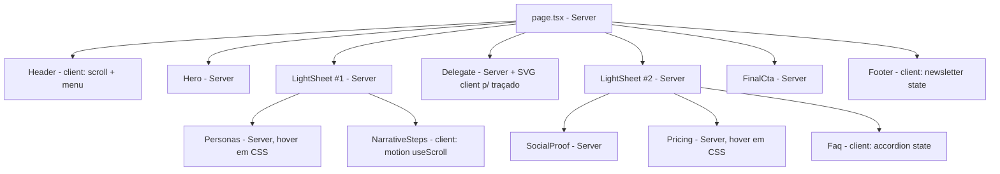

# Evolution Landing Page Design

**Spec**: `.specs/features/evolution-landing-page/spec.md`
**Status**: Approved (arquitetura confirmada com o usuário em 2 decisões: limite Server/Client, ritmo de fundo)

---

## Architecture Overview

**Server-first com ilhas de client.** `page.tsx` continua Server Component e
compõe as 11 seções em ordem fixa. Cada seção recebe seu conteúdo como props de
arquivos tipados em `src/lib/content/`. Só viram `"use client"` os componentes com
estado real de interação: `Header` (estado de scroll + menu mobile), `NarrativeSteps`
(passo ativo do scrollytelling, via hooks do pacote `motion` já presente na stack),
`FaqAccordion` (estado expandido/colapsado) e `NewsletterForm` (estado de submissão
simulada). Hover de cards (Personas, Pricing) é resolvido em CSS puro
(`:hover`/`:focus-visible`), sem JS.

Duas "folhas" claras (`LightSheet`, reaproveitado) alternam com o fundo preto,
mantendo o ritmo transversal da referência (preto → branco → preto → branco →
preto):



**Por que não as outras duas abordagens consideradas:** um `ScrollProvider` central
"use client" no topo converteria a árvore inteira em Client Components, perdendo
streaming/SSR das seções puramente estáticas (Pricing, FAQ, Social Proof) e inflando
o bundle de JS — direto contra o NFR de Core Web Vitals. `animation-timeline`
CSS-only elimina JS mas ainda tem suporte incompleto em Safari/Firefox — arriscado
para um case de portfólio visto em navegadores variados; fica reservado como reforço
opcional via `@supports`, nunca como mecanismo principal.

---

## Code Reuse Analysis

### Existing Components to Leverage

| Component | Location | How to Use |
|---|---|---|
| `Button` + `buttonVariants` | `src/components/ui/button.tsx` | Reusar para todo CTA (primário=`default`, secundário=`outline`/`secondary`). O glow do CTA hero/final é um wrapper visual (`GlowButton` novo) em volta do `Button` existente — não um novo `variant` na CVA, para não acoplar um efeito de página específica ao design system de botão. |
| `cn` | `src/lib/utils.ts` (re-exporta `cn` do pacote `cn`) | Merge de classes em todo componente novo, como já é convenção do preset `radix-nova`. |
| Tokens do preset `radix-nova` (`--radius-*`, `--color-primary`, etc.) | `src/app/globals.css` | Os tokens do `DESIGN-REFERENCE.md` (`--color-bg-page`, `--color-accent-*`, etc.) são **adicionados** ao bloco `@theme inline` existente, não duplicados — ver Risco 1 abaixo. |

### Integration Points

| Sistema | Método de integração |
|---|---|
| `next/font/google` (Outfit) | Substitui `Geist`/`Geist_Mono` em `src/app/layout.tsx`; variável CSS única (`--font-outfit`) mapeada em `--font-sans` no `@theme`. |
| `next/image` | Toda mídia de seção (fotos do Narrative/Delegate, ilustrações) usa `<Image>` com `width`/`height` explícitos ou `fill` dentro de container com aspect-ratio fixo — nunca `` cru. |
| `next-themes` | Mantido só para satisfazer o `ThemeProvider` que o shadcn/Radix Nova espera; forçado em `dark` fixo (`forcedTheme="dark"` ou equivalente), sem toggle — decisão de tema único já registrada no `DESIGN-REFERENCE.md`. |
| `motion` (Motion for React) | `useScroll` + `useTransform`/`useMotionValueEvent` dentro de `NarrativeSteps` para o passo ativo; `whileInView` para entradas fade+translate das demais seções (Personas, Pricing, cards). Import de `motion/react`, não da API legada `framer-motion`. |
| Radix Accordion | Ainda não presente em `src/components/ui/`; adicionar via `shadcn add accordion` como task de Execute — não escrever um accordion do zero, o preset já resolve foco/ARIA. |

---

## Components

### `src/lib/content/types.ts`

- **Purpose**: Tipos compartilhados de conteúdo (nav, ícone, CTA) usados por todos os arquivos de `src/lib/content/`.
- **Location**: `src/lib/content/types.ts`
- **Interfaces**:
  - `type IconName = keyof typeof import("lucide-react")` (ou união literal restrita aos ícones realmente usados, mais segura para tree-shaking)
  - `interface CtaContent { label: string; href: string; variant: "primary" | "secondary" }`
  - `interface NavLink { label: string; href: string }`
- **Dependencies**: nenhuma
- **Reuses**: n/a (arquivo-raiz de tipos)

### `src/lib/content/{header,hero,personas,narrative,delegate,social-proof,pricing,faq,final-cta,footer}.ts`

- **Purpose**: Um arquivo por seção, cada um exportando uma constante tipada com o conteúdo daquela seção (copy, itens de lista, planos, perguntas). Nunca conteúdo hardcoded em JSX — requisito não-funcional do brief.
- **Location**: `src/lib/content/*.ts`
- **Interfaces** (exemplos representativos, um por arquivo):
  - `export const heroContent: HeroContent` — título em partes (`dimmed`/`accent`/`foreground` conforme a mecânica de dois tons), parágrafo, CTA
  - `export const personaCards: PersonaCardContent[]` — 2 itens (operações / TI)
  - `export const narrativeSteps: NarrativeStepContent[]` — 3 itens (texto + mídia)
  - `export const pricingPlans: PricingPlan[]` — 4 itens (Starter/Growth/Scale/Enterprise)
  - `export const faqItems: FaqItem[]`
- **Dependencies**: `./types.ts`
- **Reuses**: n/a

### `SectionTitle` (comum)

- **Purpose**: Implementa a "regra de sistema" §2.4 do `DESIGN-REFERENCE.md` — título de dois tons — reutilizada por Hero, Personas, Narrative (títulos de passo), Delegate e FinalCta, para a mecânica não ser reimplementada 5 vezes.
- **Location**: `src/components/common/section-title.tsx`
- **Interfaces**:
  - `SectionTitle({ parts: Array<{ text: string; tone: "dimmed" | "accent" | "foreground" }>; as?: "h1" | "h2" }): JSX.Element`
- **Dependencies**: `cn`
- **Reuses**: tokens `--text-display`/`--text-h1`, `--color-text-dimmed`, `--color-accent-*`

### `GlowButton` (comum)

- **Purpose**: CTA com glow verde difuso (Hero + FinalCta), sem criar um novo `variant` no `Button` do design system.
- **Location**: `src/components/common/glow-button.tsx`
- **Interfaces**:
  - `GlowButton({ href, children }: { href: string; children: React.ReactNode }): JSX.Element`
- **Dependencies**: `Button` (`src/components/ui/button.tsx`), token `--shadow-cta-glow`
- **Reuses**: `Button` (`variant="default"`); aplica o glow via `box-shadow` do token, estático quando `prefers-reduced-motion: reduce` (media query CSS, sem JS)

### `Header` — client

- **Purpose**: Cabeçalho sticky com estado de scroll (fundo+blur após 8px) e menu mobile.
- **Location**: `src/components/sections/header.tsx`
- **Interfaces**:
  - `Header({ nav, cta }: { nav: NavLink[]; cta: { secondary: CtaContent; primary: CtaContent } }): JSX.Element`
- **Dependencies**: `"use client"`; `useState` para `scrolled` e `mobileMenuOpen`; listener de `scroll` com `{ passive: true }` (não usa `motion` aqui — é um booleano simples, não vale o custo de um hook de scroll contínuo)
- **Reuses**: `Button` para os CTAs; foco do menu mobile gerenciado com `ref` + `useEffect` (mover foco ao abrir, devolver ao fechar) — atende HDR-04

### `Hero` — server

- **Purpose**: Seção de abertura, título bicolor + CTA único com glow.
- **Location**: `src/components/sections/hero.tsx`
- **Interfaces**: `Hero({ content }: { content: HeroContent }): JSX.Element`
- **Dependencies**: nenhuma (Server Component puro)
- **Reuses**: `SectionTitle`, `GlowButton`

### `LightSheet` — server

- **Purpose**: Wrapper estrutural que implementa a "folha" clara (raio superior/inferior grande, gutter lateral, fundo `surface-sheet`). Reaproveitado 2x (Personas+Narrative; SocialProof+Pricing+Faq).
- **Location**: `src/components/common/light-sheet.tsx`
- **Interfaces**: `LightSheet({ children }: { children: React.ReactNode }): JSX.Element`
- **Dependencies**: nenhuma
- **Reuses**: tokens `--radius-sheet`, `--container-sheet-gutter`, `--color-surface-sheet`

### `Personas` — server

- **Purpose**: Par de cards (time de operações / time de TI).
- **Location**: `src/components/sections/personas.tsx`
- **Interfaces**: `Personas({ content }: { content: PersonaCardContent[] }): JSX.Element`
- **Dependencies**: nenhuma
- **Reuses**: `SectionTitle`, `Button`; hover via CSS (`hover:` + `focus-visible:` do Tailwind, sem estado de JS) — atende PERSONA-03/04

### `NarrativeSteps` — client

- **Purpose**: Scrollytelling sticky de duas colunas; ativa um passo por vez conforme o scroll.
- **Location**: `src/components/sections/narrative-steps.tsx`
- **Interfaces**: `NarrativeSteps({ steps }: { steps: NarrativeStepContent[] }): JSX.Element`
- **Dependencies**: `"use client"`; `motion/react` (`useScroll` com `target`+`offset` por passo, ou `useMotionValueEvent` sobre o progresso da seção inteira para derivar o índice ativo — decisão de implementação fica para a task, não trava aqui); `prefers-reduced-motion` lido via `window.matchMedia` para pular para o estado final (NARRATIVE-06)
- **Reuses**: `SectionTitle` (por passo), `next/image` (mídia)

### `Delegate` — server (+ ilha client pontual)

- **Purpose**: Seção assimétrica com cards kanban sobrepostos e anotação manuscrita + seta.
- **Location**: `src/components/sections/delegate.tsx` (server) + `src/components/sections/delegate-annotation.tsx` (client, só se a seta usar traçado SVG animado)
- **Interfaces**:
  - `Delegate({ content }: { content: DelegateContent }): JSX.Element`
  - `DelegateAnnotation({ reduceMotion }: { reduceMotion?: boolean }): JSX.Element` — isolado para o `"use client"` não vazar para o resto da seção, que continua Server Component
- **Dependencies**: `motion/react` (`whileInView` no traçado, se usado)
- **Reuses**: `SectionTitle`, `next/image`

### `SocialProof` — server

- **Purpose**: Faixa de logos + depoimentos, todos fictícios, com nota explícita de que são ilustrativos.
- **Location**: `src/components/sections/social-proof.tsx`
- **Interfaces**: `SocialProof({ content }: { content: SocialProofContent }): JSX.Element`
- **Dependencies**: nenhuma
- **Reuses**: `next/image` para os logos fictícios (gerados/ilustrativos, não arquivos de marcas reais)

### `Pricing` — server

- **Purpose**: 4 cards de plano (3 autosserviço + Enterprise).
- **Location**: `src/components/sections/pricing.tsx`
- **Interfaces**: `Pricing({ plans }: { plans: PricingPlan[] }): JSX.Element`
- **Dependencies**: nenhuma
- **Reuses**: `SectionTitle`, `Button`; destaque de "Recomendado" e hover/focus via CSS (`aria-current`/classe condicional no card, sem JS) — atende PRICING-03/04

### `Faq` — client

- **Purpose**: Lista de perguntas em accordion acessível.
- **Location**: `src/components/sections/faq.tsx`
- **Interfaces**: `Faq({ items }: { items: FaqItem[] }): JSX.Element`
- **Dependencies**: `"use client"`; Radix `Accordion` (adicionar via `shadcn add accordion` — task de Execute, não escrever do zero)
- **Reuses**: componente `Accordion` do shadcn (gerencia `aria-expanded`/`aria-controls` — atende FAQ-02/03 de graça)

### `FinalCta` — server

- **Purpose**: CTA de fechamento antes do footer.
- **Location**: `src/components/sections/final-cta.tsx`
- **Interfaces**: `FinalCta({ content }: { content: HeroContent }): JSX.Element` (reaproveita o mesmo shape de `HeroContent` — mesmo componente de botão/glow, conteúdo diferente)
- **Dependencies**: nenhuma
- **Reuses**: `SectionTitle`, `GlowButton` — o mesmo componente de glow da Hero, não uma variante nova (atende CTA-01)

### `Footer` — client (só a ilha da newsletter)

- **Purpose**: Rodapé completo — logo, 3 colunas, newsletter, redes, legal.
- **Location**: `src/components/sections/footer.tsx` (server) + `src/components/sections/newsletter-form.tsx` (client)
- **Interfaces**:
  - `Footer({ content }: { content: FooterContent }): JSX.Element`
  - `NewsletterForm(): JSX.Element` — estado local de "enviado" (`useState`), sem chamada de rede (FOOTER-02)
- **Dependencies**: `"use client"` isolado só no `NewsletterForm`
- **Reuses**: `new Date().getFullYear()` inline no `Footer` (server), nunca hardcoded (FOOTER-04)

---

## Data Models

```typescript
// src/lib/content/types.ts
export interface CtaContent {
  label: string
  href: string
  variant: "primary" | "secondary"
}

export interface NavLink {
  label: string
  href: string
}

export type TextTone = "dimmed" | "accent" | "foreground"

export interface TitlePart {
  text: string
  tone: TextTone
}

// src/lib/content/hero.ts
export interface HeroContent {
  titleParts: TitlePart[]
  paragraph: string
  cta: CtaContent
}

// src/lib/content/personas.ts
export interface PersonaCardContent {
  id: "operations" | "it"
  title: string
  description: string
  bullets: string[]
  cta: CtaContent
}

// src/lib/content/narrative.ts
export interface NarrativeStepContent {
  id: string
  titleParts: TitlePart[]
  supportingText: string
  media: { src: string; alt: string }
}

// src/lib/content/delegate.ts
export interface DelegateContent {
  titleParts: TitlePart[]
  paragraph: string
  media: { src: string; alt: string }
  kanban: { backlog: KanbanCardContent; delegated: KanbanCardContent }
  annotation: string
}

export interface KanbanCardContent {
  label: string
  taskTitle: string
  assignees: { label: string; name: string }[]
  dateRange: string
}

// src/lib/content/social-proof.ts
export interface SocialProofContent {
  disclaimer: string // "empresas e depoimentos ilustrativos"
  logos: { name: string; src: string }[]
  testimonials: { quote: string; name: string; role: string; company: string }[]
}

// src/lib/content/pricing.ts
export interface PricingPlan {
  id: string
  name: string
  price: string | "Sob consulta"
  recommended?: boolean
  features: string[]
  cta: CtaContent
}

// src/lib/content/faq.ts
export interface FaqItem {
  question: string
  answer: string
}

// src/lib/content/footer.ts
export interface FooterContent {
  description: string
  columns: { title: string; links: NavLink[] }[]
  socials: { label: string; href: string; icon: IconName }[]
  legalLinks: NavLink[]
}
```

**Relationships**: todos são independentes entre si — não há relação relacional
(FK-like), cada seção consome só o próprio arquivo de conteúdo. `TitlePart[]` é o
único tipo verdadeiramente compartilhado (usado por Hero, Narrative, Delegate,
FinalCta), refletindo a regra de sistema §2.4.

---

## Error Handling Strategy

| Cenário | Tratamento | Impacto para o usuário |
|---|---|---|
| Imagem de mídia falha ao carregar | `next/image` reserva dimensões via `width`/`height`; `alt` sempre definido no conteúdo tipado | Layout não colapsa; texto alternativo visível |
| JavaScript desabilitado/falha ao carregar | Toda seção Server Component renderiza normalmente (progressive enhancement); só `NarrativeSteps` perde a ativação por scroll e `Faq`/`NewsletterForm` perdem interatividade — mas o conteúdo continua legível em HTML semântico | Sem quebra de conteúdo; perda controlada de animação/interação |
| Newsletter submetida com campo vazio | `NewsletterForm` (client) valida só a presença de valor antes de mostrar a confirmação simulada — não há chamada de rede que possa falhar | Feedback visual imediato, sem erro de rede possível |

---

## Risks & Concerns

| Concern | Location | Impact | Mitigation |
|---|---|---|---|
| Tokens do preset `radix-nova` (`--primary`, `--radius`, paleta neutra oklch) coexistem com os tokens novos do `DESIGN-REFERENCE.md` no mesmo `@theme inline` | `src/app/globals.css:7-49` | Risco de dois sistemas de cor divergentes no mesmo arquivo, ou de um componente shadcn futuro puxar a paleta neutra errada | Task de Execute remapeia `--primary`/`--accent`/`--radius` do preset para os tokens do Evolution em vez de duplicar; nenhum token novo com nome colidente |
| Fonte atual é Geist, não Outfit | `src/app/layout.tsx:5-13` | Se esquecido, a página não usa a tipografia decidida no DESIGN-REFERENCE | Task de Execute troca o import de `next/font/google` explicitamente antes de qualquer seção ser construída |
| Nenhum componente Accordion existe em `src/components/ui/` | `src/components/ui/` (só `button.tsx` hoje) | `Faq` não pode ser implementada sem esse primitivo | Task de Execute roda `shadcn add accordion` antes de implementar `Faq` |
| Mecanismo exato de "passo ativo" do `NarrativeSteps` (offsets do `useScroll`) não foi prototipado | `src/components/sections/narrative-steps.tsx` (não existe ainda) | Risco de a primeira implementação exigir ajuste fino de thresholds | Tratado como detalhe de implementação da task, não do design; task inclui verificação visual manual antes do commit |

> Nenhum risco de segurança, dado sensível ou dependência externa em runtime foi
> identificado — página estática, sem autenticação, sem chamada de rede no cliente.

---

## Tech Decisions

| Decisão | Escolha | Racional |
|---|---|---|
| Limite Server/Client | Server-first, ilhas de client mínimas | Confirmado com o usuário — ver Architecture Overview |
| Ritmo de fundo das seções novas | 2ª `LightSheet` envolve Social Proof + Pricing + FAQ | Confirmado com o usuário — evita 4 seções pretas seguidas |
| Mecanismo de scroll do Narrative | Hooks do pacote `motion` (`useScroll`/`useMotionValueEvent`), não `IntersectionObserver` cru nem scroll listener manual | `motion` já é dependência fixa do projeto; reaproveitar evita reinventar throttling/rAF |
| Glow do CTA | Componente `GlowButton` que envolve `Button`, não um novo `variant` na CVA | Mantém o design system de botão genérico; o glow é específico de duas seções (Hero, FinalCta), não do componente Button em si |
| Accordion do FAQ | Adicionar via `shadcn add accordion` (Radix) | Reuso do preset já instalado (`radix-nova`) em vez de reimplementar ARIA/foco manualmente |

> **Decisão de projeto (candidata a `AD-001`):** "Server-first, ilhas de client
> mínimas" é o primeiro padrão arquitetural do projeto — será registrado em
> `.specs/STATE.md` como decisão ativa para orientar features futuras nesta base
> de código.

---

## Tips

(seção de referência do template, sem conteúdo adicional necessário aqui)
